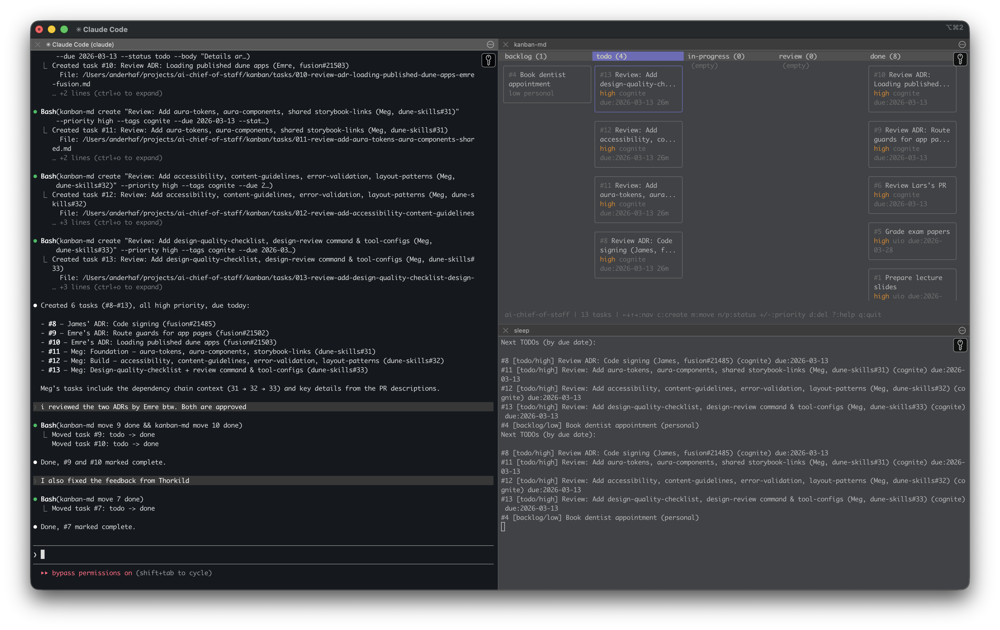

# AI Chief of Staff

A personal AI workspace that knows who you are, what you're working on, and helps you manage tasks, decisions, and context across all areas of your life — work, personal projects, and anything in between.



## Features

- **Claude always at hand** — a dedicated window with Claude Code ready to receive anything you throw at it: Slack posts, PRs to review, threads to respond to, decisions to make
- **Persistent memory** — the agent is instructed to write everything back to `AGENTS.md` files: decisions made, people mentioned, project updates, priorities. Context accumulates over time instead of resetting each session
- **Interactive task board** — a live kanban TUI in the terminal for managing and navigating your work
- **Next-up task view** — a live pane showing upcoming tasks sorted by due date, so you always know what to do next

## What it is

AI Chief of Staff is a Claude Code project template structured to give your AI assistant persistent context about you. Rather than starting every conversation from scratch, your AI knows your name, your role, your responsibilities, the people in your life, and your current projects. It acts as a chief of staff: keeping track of tasks, helping you think through decisions, drafting communications, and picking up context where you left off.

The workspace uses:
- **Claude Code** (or Cursor) as the AI interface
- **kanban-md** for task tracking, fully integrated into the AI's context
- **AGENTS.md files** throughout the directory tree to give the AI structured context for each area of your life

## What to expect

- Your AI will read your personal context from `AGENTS.md` at startup and tailor its responses accordingly
- Tasks live in `kanban/` and the AI can create, move, and reason about them natively
- Context is organized by area: `personal/` for personal life, and a work folder (default: `cognite/`) for your job — rename or add folders as needed
- The iTerm2 script opens a 3-pane layout: Claude Code on the left, the kanban TUI top-right, and a live TODO list bottom-right

## Getting started

### 1. Prerequisites

- [Claude Code](https://docs.anthropic.com/claude-code) installed and authenticated
- [kanban-md](https://github.com/jmhobbs/kanban-md) installed
- iTerm2 (optional, for the 3-pane layout script)

### 2. Clone and set up

```bash
git clone <this-repo> ~/your-chief-of-staff
cd ~/your-chief-of-staff
```

### 3. Initialize kanban

```bash
kanban-md init
kanban-md skill install   # choose Claude Code, Cursor, etc.
```

### 4. Configure your personal context

Open `AGENTS.md` and fill in your details — name, location, family, work, and any other contexts you want the AI to know about. Then do the same for `personal/AGENTS.md` and your work folder's `AGENTS.md`.

### 5. Rename the work folder

The default work folder is called `cognite/`. Rename it to match your company or context:

```bash
mv cognite/ mycompany/
```

Update any references in `AGENTS.md` accordingly.

### 6. Open your workspace

The recommended way to use this is the **3-pane iTerm2 layout**. Run it once and leave it open all day:

```bash
./scripts/iterm-layout.sh

# With auto-approved permissions (use at your own discretion)
./scripts/iterm-layout.sh --dangerously-skip-permissions
```

This gives you:
- **Left** — Claude Code, always ready. Just drop things in: a Slack thread, a PR link, a decision you need to make, a quick "remember that..."
- **Top right** — the kanban board TUI, interactive and always visible
- **Bottom right** — upcoming tasks sorted by due date

The intended workflow is to keep this layout open and treat Claude as your always-on chief of staff. Paste things in, think out loud, ask for help — it will handle the task tracking, memory, and context automatically.

If you prefer to work without iTerm2:

```bash
claude
```

## Working with tasks

The primary way to manage tasks is through Claude — just describe what you need and it will create, update, or move tasks for you.

You can also manage tasks directly from the terminal:

```bash
# Add a task
kanban-md add "Review PR #123" --tag work --due 2026-03-15

# List tasks
kanban-md list --compact --tag work

# Move a task
kanban-md move <task-id> doing

# Open the interactive board
kanban-md tui
```

## Directory structure

```
.
├── AGENTS.md              # Your personal context — fill this in first
├── personal/
│   └── AGENTS.md          # Personal life context
├── cognite/               # Work context (rename to your company)
│   ├── AGENTS.md          # Company and role overview
│   ├── atlas/             # One folder per product, project, or team
│   │   └── AGENTS.md
│   └── team/
│       └── AGENTS.md
├── kanban/                # Task board (managed by kanban-md)
│   └── tasks/
├── scripts/
│   └── iterm-layout.sh    # Opens the 3-pane iTerm2 layout
└── .claude/               # Claude Code skills and settings
```

Memory is organized as folders, not flat files. The agent creates new subfolders as topics grow — each product, project, team, or recurring process gets its own `AGENTS.md`. Context accumulates in the right place rather than piling up in a single file.

## Tips

- The more context you put in `AGENTS.md` files, the more useful the AI becomes
- Add sub-folders with their own `AGENTS.md` for projects, teams, or topics that need deeper context
- Use tags (`work`, `personal`, `admin`) to filter tasks by area: `kanban-md list --tag work`
- Set due dates on tasks so the live TODO pane shows what's coming up
